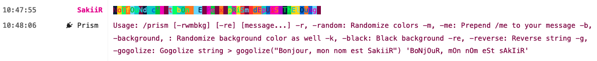

# thelounge-plugin-prism

Simple plugin for the irc client [thelounge](https://thelounge.chat) that allows you to apply rainbow colors to a message

# Installation

- If you have installed thelounge via NPM/Yarn:

  `thelounge install thelounge-plugin-prism`

- If you have installed thelounge via source:

  `node index.js install thelounge-plugin-prism`

# Usage

`/prism [message...]` -> Color your message

```
/prism -b -g -r 'Notfound c'est bon je peux prism depuis thelounge'
```



# Development

Currently thelounge doesn't offer a way to install packages from source without npm,
thats why you have to do it manually.

The easiest way is installing thelounge locally and adding this plugin as a new package in the THELOUNGE_HOME/packages dir.
For that you need to have a package.json in that packages dir that looks kinda like this:

```json
{
  "private": true,
  "description": "Packages for The Lounge. All packages in node_modules directory will be automatically loaded.",
  "dependencies": {
    "thelounge-plugin-prism": "1.0.1"
  }
}
```

the important thing in the name here.

You then need to create a folder with that name in the node_modules sub dir.
We then need to place our index.js and package.json in that dir.
You can either do that manually by just copy pasting it, but that would involve copy pasting it for every change.
I would recommend symlinking the files from the project into the packages folder, kinda like this:

```
ln package.json ~/.thelounge/packages/node_modules/thelounge-plugin-prism/package.json
ln index.js ~/.thelounge/packages/node_modules/thelounge-plugin-prism/index.js
```

You can then just edit and commit the files in the project dir and restart thelounge
on every change you do and the changes will be picked up.
